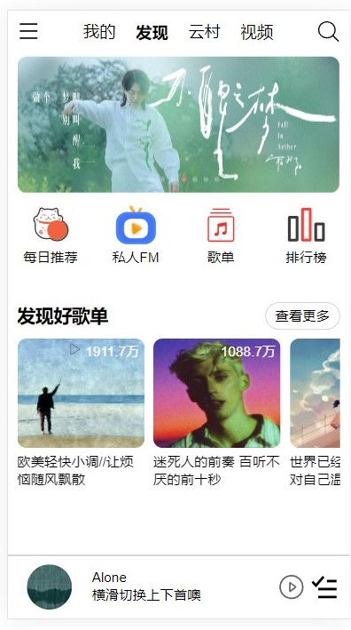
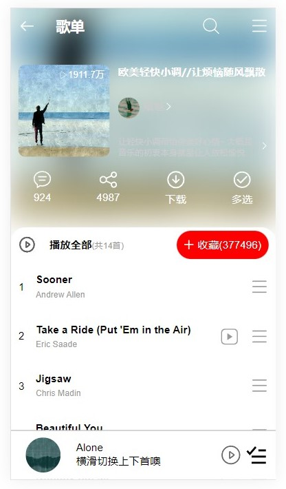
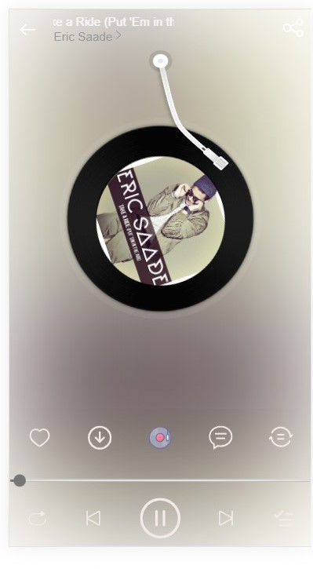
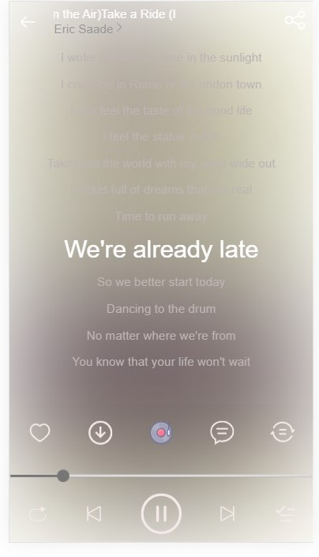

<<<<<<< HEAD
# vue版网易云音乐

> api：ap使用的是一个开源的nodejs封装的网易云音乐api，[地址](https://binaryify.github.io/NeteaseCloudMusicApi/#/?id=%e5%ae%89%e8%a3%85)

## 使用步骤

``` bash
# 下载
git clone git@github.com:ADiao233/MusicSys.git

# 安装依赖
npm install

# 运行开发环境
npm run dev

# 构建生产环境
npm run build

```

## 技术栈
 + vue3：基础框架
 + vue-router4：路由跳转
 + vuex：全局数据管理
 + es6：采用部分es6特性，大大简化了写法
 + webpack：vue-cli基于webpack，修改了部分配置
 + axios：基于Promise的http库，用来请求数据
 + less：写起css来十分方便
 + flex：弹性布局，在移动端兼容性较好，写各种布局非常方便
 + [vant](https://vant-contrib.gitee.io/vant/#/zh-CN)：移动端上ui组件库

## 说明
1. 这个项目大小组件大概二十几个，目前还未完工，以后还会继续更新，目标是还原整个网易云音乐（虽然不知道什么时候能填完坑o(╯□╰)o）。
2. 关于体会，写到这个项目也算是对vue全家桶比较熟了，体会就是，不论是简单的复杂的项目，只要分割成一个个组件再拼起来，也没什么难的，组件之间通信又有vuex，也是非常简单的，总之就是熟能生巧。
4. 关于难点，对于自己来说，audio标签以前没有接触过，有点麻烦，不过还算有[相关文档](http://caibaojian.com/html5-audio.html)；歌词滚动效果，歌词滚动效果采取是DOM元素的scroll和offsetTop判断，动画过渡有点生硬，部分歌曲还是有点问题，待解决;当前歌曲在播放列表中的索引获取，通过vuex存储当前歌单和歌曲索引，找到当前歌曲的id在数组中的位置。
4. 关于ui组件库，用了vant的轮播图实现首页图片轮播。歌曲歌名显示用vue3Marquee走马灯实现。
5. 关于移动设备适配，我使用的是js动态设置html元素font-size的方式，页面元素使用rem，这样可达到在不同设备下显示内容基本一样的效果，具体可以[点击](https://segmentfault.com/a/1190000008721148)，使用方式比如width:100px;可以写成width:pr(100)。
6. 关于图标，使用的是的iconfont字体图标方案，相比于使用图片图标有许多优势，比如任意缩放、改变颜色、响应式适配设备等等，具体可以参考[这篇文章](https://www.w3cplus.com/css3/icon-fonts.html)。


## 功能
- [x] 首页歌单推荐
- [x] 歌单详情
- [x] 播放器
- [x] 播放暂停
- [x] 歌词滚动
- [x] 歌曲拖动
- [x] 播放器底部背景
- [x] 播放底栏
- [x] 播放列表
- [x] 搜索推荐
- [x] 搜索分类

## 部分截图




=======
>>>>>>> 791684f (v1.0)
